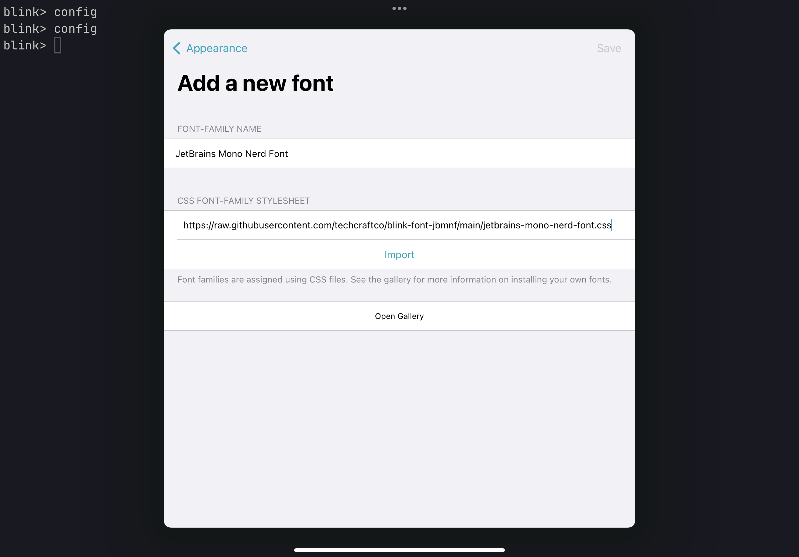

A CSS font specification for the full [JetBrains Mono Nerd Font](https://github.com/ryanoasis/nerd-fonts) (complete with ligatures) for use in [Blink](https://blink.sh)

## Installing

In Blink, run the `config` command to bring up the Settings window.

Choose Appearance and then, under Fonts, choose Add a new font.

Enter any Font Family Name you like, and paste `https://github.com/techcraftco/blink-font-jbmnf/raw/main/jetbrains-mono-nerd-font.css` into the CSS Font Family Stylesheet field. 

Hit Import and then hit Save. You can now select your new font family in the font selector.